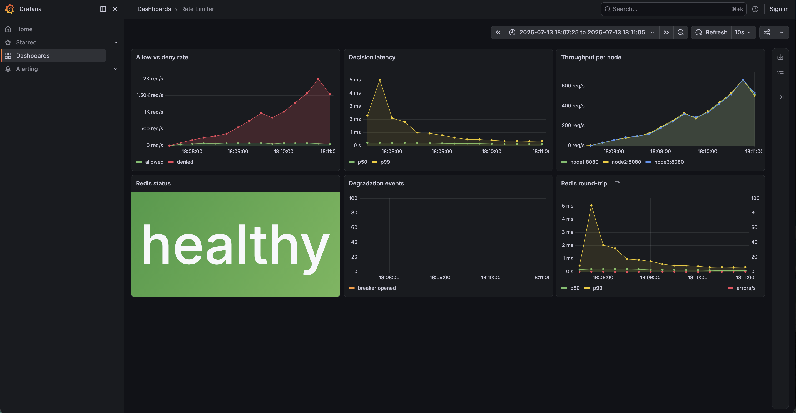
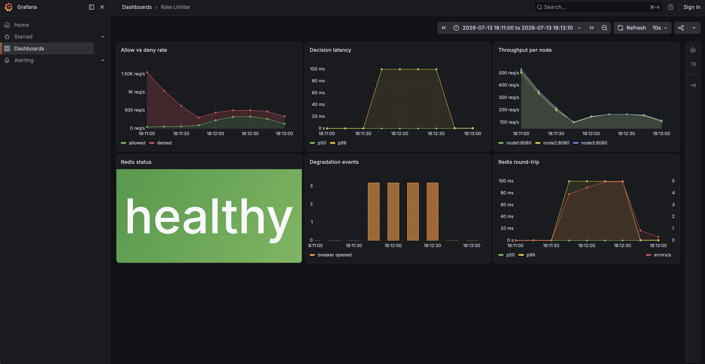

# Distributed Rate Limiter

[](https://github.com/sohipan21/distributed-rate-limiter/actions/workflows/test.yml)

Rate limiting as a service. Multiple stateless Go nodes share one Redis, so a
limit like "100 requests per minute" holds no matter which node answers — and
the service keeps working when Redis doesn't.

Go, Redis with Lua scripts for atomic counting, gRPC plus an HTTP shim, a
drop-in Go SDK, Prometheus + Grafana, Docker Compose for the multi-node setup,
k6 for load testing.

## How it works

```
client ──> node ──┐
client ──> node ──┼──> redis   (holds the counts, decides allow or deny)
client ──> node ──┘
```

Nodes keep no state. Counts live in Redis, and every check-and-update runs as
a Lua script inside Redis, so concurrent nodes can't race each other past the
limit. A concurrency test runs the same flood against a deliberately naive
read-modify-write version and the atomic one:

```
make up && go test -v -run 'Overcounts|ExactUnder' ./internal/store/
```

The naive version lets 500 requests through a limit of 100; the atomic one
allows exactly 100, every time. Redis's clock is the single time source, so
nodes never disagree about window boundaries. Why the counting works this way
is in [docs/04-tradeoffs.md](docs/04-tradeoffs.md).

Two algorithms sit behind one `Limiter` interface, chosen per policy: token
bucket (cheap, tolerates short bursts — the default) and sliding window
(exact, a bit more memory). There's also an in-memory mode with no Redis for
single-node use.

When Redis is unreachable the service fails open by default: requests pass
through unlimited until Redis returns, with a circuit breaker keeping the
failure cheap. `-degrade closed` flips that for cases where over-limit is
worse than down (login attempts, paid quotas) — the tradeoffs doc covers when
to pick which. `make demo` shows the whole thing live: enforcement, Redis
killed, service still answering, enforcement back.

## Try it

```
make up                                    # start redis in docker
go run ./cmd/server -redis localhost:6379  # drop -redis for in-memory mode
```

```
$ curl -si -X POST localhost:8080/check \
    -d '{"identity":"alice","tier":"free","endpoint":"/download"}'
HTTP/1.1 200 OK
X-RateLimit-Limit: 10
X-RateLimit-Remaining: 9
X-RateLimit-Reset: 1783732312

{"allowed":true,"remaining":9,"retry_after_seconds":0,"reset_at":1783732312}
```

Over the limit, the status becomes `429 Too Many Requests` with a
`Retry-After` header. Same behavior over gRPC on `:9090`.

## Results

k6 against the full cluster (three nodes behind nginx, one Redis) on a single
laptop. Localhost numbers, so read them as a shape, not a promise.

| offered | achieved | p50 | p95 | p99 | allowed / denied |
|---------|----------|------|------|------|------------------|
| 300 rps | 300 rps | 1.31ms | 2.97ms | 4.82ms | 5075 / 12903 |
| 1000 rps | 1000 rps | 0.69ms | 0.95ms | 1.39ms | 5223 / 54777 |
| 2000 rps | 2000 rps | 0.58ms | 0.78ms | 1.34ms | 5253 / 114749 |

Allowed stays flat while denied grows: past a point the extra load just
becomes 429s. No errors at any level.



A fourth run killed Redis mid-test. 44,991 requests, zero failures — allowed
jumps while the service fails open, then enforcement snaps back when Redis
returns.



`make loadtest` reproduces these.

## Use it in your own app

```go
import "github.com/sohipan21/distributed-rate-limiter/pkg/sdk"

client, err := sdk.Dial("localhost:9090")
if err != nil {
    log.Fatal(err)
}

// wrap your handler; that's the whole integration
http.ListenAndServe(":8090", sdk.Middleware(client)(yourHandler))
```

Callers are identified by the `X-API-Key` header (falling back to IP), with
the request path as the endpoint; override with `sdk.WithKeyFunc`. A runnable
version is in [examples/protected-server](examples/protected-server/main.go).

## Layout

```
cmd/server        the service (http + grpc)
internal/limiter  the two algorithms behind one interface
internal/policy   maps a request to its limit (tiers, per-endpoint overrides)
internal/store    redis-backed limiters, the lua scripts, the circuit breaker
internal/grpcapi  grpc server        internal/httpapi  http handlers
internal/metrics  prometheus metrics
pkg/sdk           the drop-in client and middleware
grafana/          dashboard as code   loadtest/  k6 scripts and results
demo/             the kill-redis demo
```

Redis-backed tests skip themselves when Redis is not running, so `make` works
without Docker.
