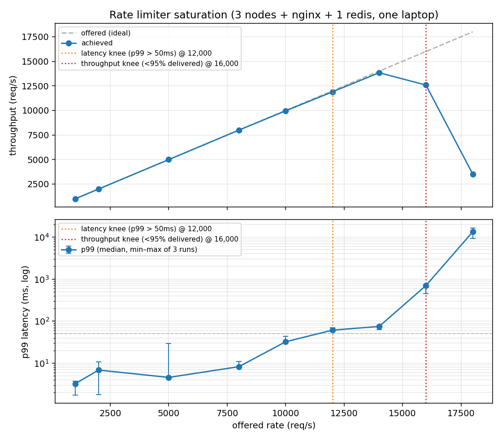

# Distributed Rate Limiter

[](https://github.com/sohipan21/distributed-rate-limiter/actions/workflows/test.yml)

Rate limiting as a service. Multiple stateless Go nodes share one Redis, so a
limit like "100 requests per minute" holds no matter which node answers. It
also keeps working when Redis doesn't.

Go, Redis with Lua scripts for atomic counting, gRPC plus an HTTP shim, a
drop-in Go SDK, Prometheus + Grafana, Docker Compose for the multi-node setup,
k6 for load testing.

## How it works

```
client ──> node ──┐
client ──> node ──┼──> redis   (holds the counts, decides allow or deny)
client ──> node ──┘
```

Nodes keep no state. Counts live in Redis, and every check-and-update runs as
a Lua script inside Redis, so concurrent nodes can't race each other past the
limit. A concurrency test runs the same flood against a deliberately naive
read-modify-write version and the atomic one:

```
make up && go test -v -run 'Overcounts|ExactUnder' ./internal/store/
```

The naive version lets 500 requests through a limit of 100; the atomic one
allows exactly 100, every time. Redis's clock is the single time source, so
nodes never disagree about window boundaries. Why the counting works this way
is in [docs/04-tradeoffs.md](docs/04-tradeoffs.md).

Two algorithms sit behind one `Limiter` interface, chosen per policy: token
bucket (cheap, tolerates short bursts, the default) and sliding window
(exact, a bit more memory). There's also an in-memory mode with no Redis for
single-node use.

When Redis is unreachable the service fails open by default: requests pass
through unlimited until Redis returns, with a circuit breaker keeping the
failure cheap. `-degrade closed` flips that for cases where over-limit is
worse than down (login attempts, paid quotas). The tradeoffs doc covers when
to pick which. `make demo` shows the whole thing live: enforcement, Redis
killed, service still answering, enforcement back.

## Try it

```
make up                                                              # start redis in docker
go run ./cmd/server -redis localhost:6379 -config config.example.yaml
```

```
$ curl -si -X POST localhost:8080/check \
    -H 'X-API-Key: k_free_demo' -d '{"endpoint":"/download"}'
HTTP/1.1 200 OK
X-RateLimit-Limit: 10
X-RateLimit-Remaining: 9
X-RateLimit-Reset: 1783732312

{"allowed":true,"remaining":9,"retry_after_seconds":0,"reset_at":1783732312}
```

Over the limit, the status becomes `429 Too Many Requests` with a
`Retry-After` header. Same behavior over gRPC on `:9090`, where the key
travels as `x-api-key` metadata.

## Who you are, and what you get

A caller presents an API key. The server looks it up and takes both the
identity and the tier from that record, so neither is something the client
can choose. Sending `"tier":"paid"` with a free key changes nothing, and
rotating the identity field does not buy a fresh quota. An unknown or missing
key is a `401`.

```
$ curl -s -o /dev/null -w '%{http_code}\n' -X POST localhost:8080/check \
    -H 'X-API-Key: bogus' -d '{"endpoint":"/download"}'
401
```

Limits and keys both live in a config file, so changing them is an edit and a
`kill -HUP <pid>`, not a redeploy. A bad edit is rejected and the running
policies stay in place.

```yaml
policies:
  default: {limit: 60, window: 1m}
  tiers:
    free: {limit: 10, window: 1m}
    paid: {limit: 100, window: 1m}
  endpoints:
    /upload: {limit: 5, window: 1m, algorithm: sliding_window}
api_keys:
  k_free_demo: {account: alice, tier: free}
  k_paid_demo: {account: bob, tier: paid}
```

## Results

k6 against the full cluster (three nodes behind nginx, one Redis) on one M2
Pro, with the generator on the same laptop. Each rate is three separate 20s runs
at a fixed arrival rate, reported as medians; `make saturate` reproduces the
sweep and [`loadtest/results/saturation/`](loadtest/results/saturation) holds
the per-run output.

| offered | achieved | p50 | p99 (median) | p99 range | errors |
|--------:|---------:|----:|-------------:|----------:|-------:|
| 1,000 | 999 | 0.66ms | 3.25ms | 1.75–3.76ms | 0% |
| 2,000 | 1,996 | 0.58ms | 6.87ms | 1.79–10.74ms | 0% |
| 5,000 | 4,991 | 0.75ms | 4.59ms | 4.28–29.81ms | 0% |
| 8,000 | 7,992 | 1.15ms | 8.26ms | 8.08–10.96ms | 0% |
| 10,000 | 9,957 | 2.01ms | 32.34ms | 32.0–43.66ms | 0% |
| 12,000 | 11,889 | 4.99ms | 61.11ms | 56.65–70.46ms | 0% |
| 14,000 | 13,835 | 11.45ms | 74.92ms | 63.01–78.37ms | 0% |
| 16,000 | 12,579 | 88.11ms | 702.84ms | 450.67–738.64ms | 0% |
| 18,000 | 3,521 | 235.54ms | 13,330ms | 9,238–16,427ms | 10.15% |



It tracks the offered rate to **14,000 rps at p99 75ms**, then falls off a
cliff: 16k delivers only 12.6k, and 18k collapses. p99 crosses 50ms at 12k, so
depending on which you care about the useful ceiling is 12k (tail budget) or
14k (throughput). Nothing errors until the cliff — past the knee requests queue
and slow down rather than fail, which is what you want from something sitting
in front of everything else. Allowed stays flat near 3,100 across the sweep
because the limits never changed; the extra load all becomes 429s.

Every rate is measured three times and the table reports medians, because a
single run near the knee swings by 3x.

**What limits it is the proxy, not the limiter.** One node hit directly
sustains ~15k rps at p99 32ms, while three nodes behind nginx sustain ~13.8k —
the proxy subtracts capacity rather than adding it, and it is the largest CPU
consumer at saturation. Redis is nowhere near its limit: script execution holds
at ~22µs per call, about a third of one core at 14k rps. Full working, plus
what proxy tuning alone was worth (2x throughput, 44x better p99), is in
[loadtest/results/saturation/attribution](loadtest/results/saturation/attribution/README.md).

Two caveats, both real. k6, three nodes, nginx and Redis share ten cores on one
laptop, so these are shapes rather than capacity promises. And the load
generator's own footprint moves the answer: at a fixed 12k offered, varying
only k6's preallocated VUs moved p99 between 50ms and 285ms. The defaults in
`loadtest/check.js` were picked from that measurement, and it is the main
reason to want a second machine before quoting any of these as a number.

### Where the time goes

Splitting a `/check` at light load and at the knee (`make breakdown`):

| layer | 2,000 rps | 12,000 rps | growth |
|---|--------:|---------:|-------:|
| lua inside redis | 0.021ms | 0.025ms | 1.2x |
| redis round trip + pool wait | 0.131ms | 4.211ms | 32x |
| handler + policy | 0.001ms | 0.002ms | 2x |
| nginx + go http + wire | 0.689ms | 6.357ms | 9x |
| end to end | 0.842ms | 10.595ms | 13x |

The rate limiting is not the expensive part. Deciding a request — refill,
compare, write back, set the TTL, all in one script — costs ~25µs and barely
moves under load; the Go handler adds ~2µs. At 12k rps the client-side Redis
call takes 4.2ms waiting on a script that runs in 0.025ms, so 99.4% of it is
round trip and pool wait. What grows under load is queueing, not computation,
which is why the fix is fewer round trips and more proxy rather than faster Lua.
Working and caveats in [docs/05-latency.md](docs/05-latency.md).

## Use it in your own app

```go
import "github.com/sohipan21/distributed-rate-limiter/pkg/sdk"

client, err := sdk.Dial("localhost:9090")
if err != nil {
    log.Fatal(err)
}

// wrap your handler; that's the whole integration
http.ListenAndServe(":8090", sdk.Middleware(client)(yourHandler))
```

The middleware forwards the caller's `X-API-Key` header to the limiter and
uses the request path as the endpoint; override either with
`sdk.WithKeyFunc`. It never sends a tier, since that is the server's to
decide. A runnable version is in
[examples/protected-server](examples/protected-server/main.go).

## Layout

```
cmd/server        the service (http + grpc)
internal/auth     api key lookup: key -> account and tier
internal/config   yaml policies and keys, reloaded on SIGHUP
internal/limiter  the two algorithms behind one interface
internal/policy   maps a request to its limit (tiers, per-endpoint overrides)
internal/store    redis-backed limiters, the lua scripts, the circuit breaker
internal/grpcapi  grpc server        internal/httpapi  http handlers
internal/metrics  prometheus metrics
pkg/sdk           the drop-in client and middleware
grafana/          dashboard as code   loadtest/  k6 scripts and results
demo/             the kill-redis demo
```

Redis-backed tests skip themselves when Redis is not running, so `make` works
without Docker.
