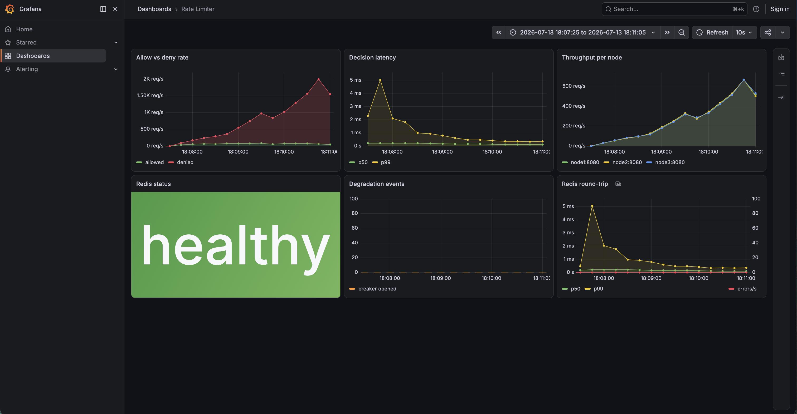
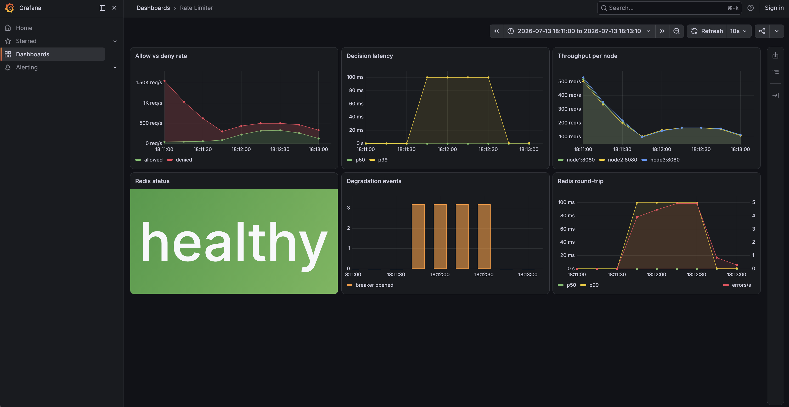

# Distributed Rate Limiter

[](https://github.com/sohipan21/distributed-rate-limiter/actions/workflows/test.yml)

Rate limiting as a service. Multiple stateless Go nodes share one Redis, so a
limit like "100 requests per minute" holds no matter which node answers. It
also keeps working when Redis doesn't.

Go, Redis with Lua scripts for atomic counting, gRPC plus an HTTP shim, a
drop-in Go SDK, Prometheus + Grafana, Docker Compose for the multi-node setup,
k6 for load testing.

## How it works

```
client ──> node ──┐
client ──> node ──┼──> redis   (holds the counts, decides allow or deny)
client ──> node ──┘
```

Nodes keep no state. Counts live in Redis, and every check-and-update runs as
a Lua script inside Redis, so concurrent nodes can't race each other past the
limit. A concurrency test runs the same flood against a deliberately naive
read-modify-write version and the atomic one:

```
make up && go test -v -run 'Overcounts|ExactUnder' ./internal/store/
```

The naive version lets 500 requests through a limit of 100; the atomic one
allows exactly 100, every time. Redis's clock is the single time source, so
nodes never disagree about window boundaries. Why the counting works this way
is in [docs/04-tradeoffs.md](docs/04-tradeoffs.md).

Two algorithms sit behind one `Limiter` interface, chosen per policy: token
bucket (cheap, tolerates short bursts, the default) and sliding window
(exact, a bit more memory). There's also an in-memory mode with no Redis for
single-node use.

When Redis is unreachable the service fails open by default: requests pass
through unlimited until Redis returns, with a circuit breaker keeping the
failure cheap. `-degrade closed` flips that for cases where over-limit is
worse than down (login attempts, paid quotas). The tradeoffs doc covers when
to pick which. `make demo` shows the whole thing live: enforcement, Redis
killed, service still answering, enforcement back.

## Try it

```
make up                                                              # start redis in docker
go run ./cmd/server -redis localhost:6379 -config config.example.yaml
```

```
$ curl -si -X POST localhost:8080/check \
    -H 'X-API-Key: k_free_demo' -d '{"endpoint":"/download"}'
HTTP/1.1 200 OK
X-RateLimit-Limit: 10
X-RateLimit-Remaining: 9
X-RateLimit-Reset: 1783732312

{"allowed":true,"remaining":9,"retry_after_seconds":0,"reset_at":1783732312}
```

Over the limit, the status becomes `429 Too Many Requests` with a
`Retry-After` header. Same behavior over gRPC on `:9090`, where the key
travels as `x-api-key` metadata.

## Who you are, and what you get

A caller presents an API key. The server looks it up and takes both the
identity and the tier from that record, so neither is something the client
can choose. Sending `"tier":"paid"` with a free key changes nothing, and
rotating the identity field does not buy a fresh quota. An unknown or missing
key is a `401`.

```
$ curl -s -o /dev/null -w '%{http_code}\n' -X POST localhost:8080/check \
    -H 'X-API-Key: bogus' -d '{"endpoint":"/download"}'
401
```

Limits and keys both live in a config file, so changing them is an edit and a
`kill -HUP <pid>`, not a redeploy. A bad edit is rejected and the running
policies stay in place.

```yaml
policies:
  default: {limit: 60, window: 1m}
  tiers:
    free: {limit: 10, window: 1m}
    paid: {limit: 100, window: 1m}
  endpoints:
    /upload: {limit: 5, window: 1m, algorithm: sliding_window}
api_keys:
  k_free_demo: {account: alice, tier: free}
  k_paid_demo: {account: bob, tier: paid}
```

Run without `-config` and the server uses built-in demo policies with auth
off, which is handy locally but trusts whatever the client claims.

## Results

k6 against the full cluster (three nodes behind nginx, one Redis) on a single
laptop. Localhost numbers, so read them as a shape, not a promise.

| offered | achieved | p50 | p95 | p99 | allowed / denied |
|---------|----------|------|------|------|------------------|
| 300 rps | 300 rps | 1.31ms | 2.97ms | 4.82ms | 5075 / 12903 |
| 1000 rps | 1000 rps | 0.69ms | 0.95ms | 1.39ms | 5223 / 54777 |
| 2000 rps | 2000 rps | 0.58ms | 0.78ms | 1.34ms | 5253 / 114749 |

Allowed stays flat while denied grows: past a point the extra load just
becomes 429s. No errors at any level.



A fourth run killed Redis mid-test. 44,991 requests, zero failures. Allowed
jumps while the service fails open, then enforcement snaps back when Redis
returns.



`make loadtest` reproduces these.

## Use it in your own app

```go
import "github.com/sohipan21/distributed-rate-limiter/pkg/sdk"

client, err := sdk.Dial("localhost:9090")
if err != nil {
    log.Fatal(err)
}

// wrap your handler; that's the whole integration
http.ListenAndServe(":8090", sdk.Middleware(client)(yourHandler))
```

The middleware forwards the caller's `X-API-Key` header to the limiter and
uses the request path as the endpoint; override either with
`sdk.WithKeyFunc`. It never sends a tier, since that is the server's to
decide. A runnable version is in
[examples/protected-server](examples/protected-server/main.go).

## Layout

```
cmd/server        the service (http + grpc)
internal/auth     api key lookup: key -> account and tier
internal/config   yaml policies and keys, reloaded on SIGHUP
internal/limiter  the two algorithms behind one interface
internal/policy   maps a request to its limit (tiers, per-endpoint overrides)
internal/store    redis-backed limiters, the lua scripts, the circuit breaker
internal/grpcapi  grpc server        internal/httpapi  http handlers
internal/metrics  prometheus metrics
pkg/sdk           the drop-in client and middleware
grafana/          dashboard as code   loadtest/  k6 scripts and results
demo/             the kill-redis demo
```

Redis-backed tests skip themselves when Redis is not running, so `make` works
without Docker.
